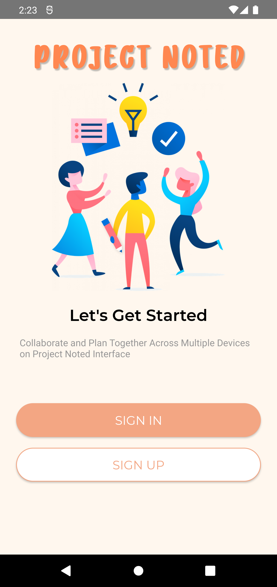

# ProjectNoted

ProjectNoted helps users to record data with a group of members that register on the same board. Users can create a specific board and add cards to it. Users can also add member to specific board and assign task to them.

## Sreenshot

## Contributing
Pull requests are welcome. For major changes, please open an issue first to discuss what you would like to change.

Please make sure to update tests as appropriate.

## License
[MIT](https://choosealicense.com/licenses/mit/)
